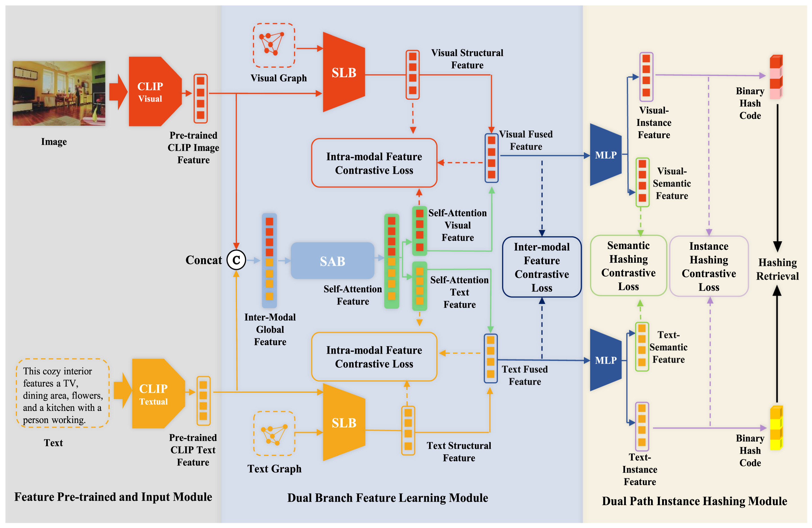

# DDSS
This repo contains the code and data associated with our INFFUS'2025 paper: [Dual-Driven Cross-Modal Contrastive Hashing Retrieval Network Via Structural Feature and Semantic Information, DDSS](https://doi.org/10.1016/j.inffus.2025.103252).

## Framework



### Demo 
Taking MIR Flickr as an example, our model can be trained and verified by the following file:
```python
demo16bit.py
```

## Datasets
Datasets takes inspiration from [UCMFH](https://github.com/XinyuXia97/UCMFH).

## Requirements

python == 3.8

numpy==1.24.3

scikit_learn==1.3.2

scipy==1.10.1

torch==2.4.1

cuda_version == 12.7
## Acknowledgments

Code and Datasets takes inspiration from [UCMFH](https://github.com/XinyuXia97/UCMFH).

### Citation
If you use this code, please cite it:
```
@article{huang2025dual,
  title={Dual-Driven cross-modal contrastive hashing retrieval network via Structural feature and Semantic information},
  author={Huang, Cheng and Liu, Wenzhe and Wang, Jinghua and Cui, Jinrong and Wen, Jie},
  journal={Information Fusion},
  pages={103252},
  year={2025},
  publisher={Elsevier}
}
```